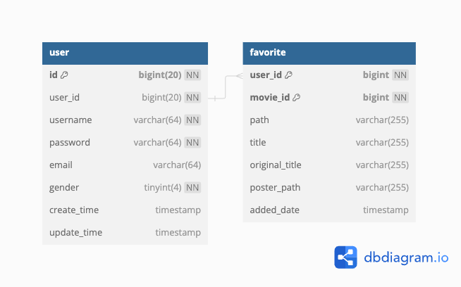

# movies.com_v2

## Overview
`movies.com_v2` is a web application designed to provide users with a platform to explore movies. The project includes a backend and frontend setup, leveraging modern web technologies for a robust and scalable solution.


## Features
- **Movie Listings**: Browse a comprehensive list of movies.
- **User Authentication**: Secure user login and registration.
- **Personal Movie Lists**: Users can add movies to their personal watchlist.

## Technologies Used
- **Backend**: Go
- **Frontend**: JavaScript, SCSS, CSS, HTML
- **Containerization**: Docker
- **Other**: Nginx, MySQL

## DB Schema


## Getting Started

### Prerequisites
- Docker
- Docker Compose

### Installation
1. Clone the repository:
   ```bash
   git clone https://github.com/yoxuan0125/movies.com_v2.git
2. Navigate to the project directory:
   ```bash
   cd movies.com_v2
3. Build and start the application using Docker Compose:
   ```bash
   docker-compose up --build

### Project Structure
- backend: Contains the Go server code and related configurations.
- frontend: Contains the React application and assets.
- docker-compose.yml: Configuration file for Docker Compose.

